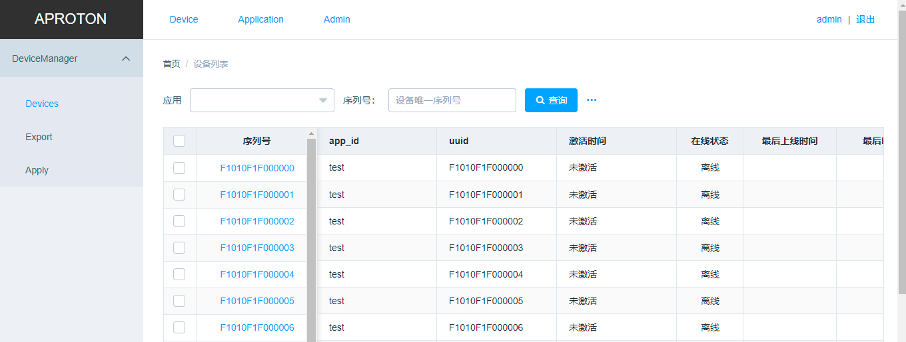

中文 | [English](./docs/eng/README.md)


# Proton-IotService


Proton-IotService 是一款开源的Iot平台，集成了设备管理后台，设备接入SDK。是一套完整的物联网解决方案，可用于快速构建物联网相关业务系统。

# 快速部署
如果想要快速体验项目，可以直接使用docker的一键化部署能力，参考  [部署手册](./docs/chs/INSTALL.md)。

当然你也可以从头开始编译项目并部署，参考 [编译手册](./docs/chs/BUILD.md)

## 开发模式
如果要快速进入开发阶段，可以执行如下的命令

```bash
docker run --name=aproton-dev-$(whoami) -p8080:8080 -p3306:3306 -p9301:9301 \
    -v $PWD:/root/iotservice -w /root/iotservice -it \
    aproton/iotservice-dev:latest /bin/bash
```

# 核心能力

## 设备管理后台
设备管理后台API接口基于Laravel开发，前端采用VUE开发。




## 设备接入API
平台提供了一套IOT设备接入的API接口，包含设备鉴权,设备属性,定位,OTA等API接口。

接口文档参考： [API](./docs/chs/device-api/README.md)


## 设备SDK
平台也提供了一套用于快速接入设备的SDK，采用C开发。代码在其他项目待合入 [quark](https://github.com/aprotontech/quark)。

# 架构设计
待补充

# 目录结构

```
+
|--- backend           # 管理台API以及设备API
|--+ extenstion        
|  |-- eletron         # PHP扩展
|--- website           # 管理台前端页面
|--- build             # 编译相关代码
|--- deploy            # 部署相关代码
```

# 开源贡献
### 分支规划

项目计划采用 五类分支模式；
+ master/main 分支： 核心开发分支，所有新代码何入到这里
+ release分支： 如果有稳定版本发布，会单独拉出来一个发布分支，比如 release/v1.0； 分支上的BUG修复需要同时合并到release分支和master分支
+ feature分支： 如果有新功能开发，从master单独拉一个分支，开发并合入master
+ bug分支： 如果需要修复bug，可以从master(or feature)分支单独拉一个分支，开发并合入。
+ 大版本分支（未来移除）： 如果需要开发的功能比较大，比如目前状态以dev1.0作为分支，未来合入master后，将废弃该模式，采用前4种分支。

### 贡献代码
+ 先从master分支checkout一个新分支，格式： feature/username_description；基于新分支开发并提交PR，CR通过后可以合入  

# 开源协议
本项目采用 [Apache License 2.0](./LICENSE) 作为开源协议

# 联系作者
+ 邮箱： kuper@aproton.tech


注： 工作比较忙，会不定期回复