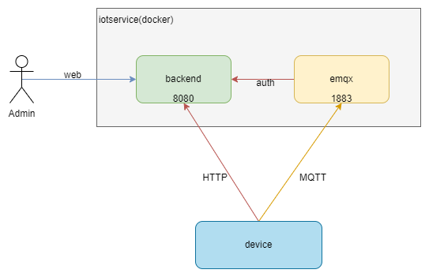

# 部署服务

## 简易部署
本项目支持docker一键部署，docker镜像可以使用预制的镜像（[镜像列表](./IMAGES.md)），也可自行编译镜像（[如何编译](./BUILD.md)）

这里假设镜像是 aproton/iotservice:v1.0-alpha （参考： [Dockerfile](../../build/deploy/Dockerfile)）。

``` bash
docker run --name=iotservice -p 8080:8080 -p 1883:1883 -p18083:18083 -d aproton/iotservice:v1.0-alpha

# 打开页面
# http://127.0.0.1:8080/index.html
# 默认登录用户名/密码： admin/admin123


# EMQX服务
# http://127.0.0.1:18083/#/
# 默认登录用户名/密码： admin/public
```

部署架构示意图




## 高可用部署
待补充