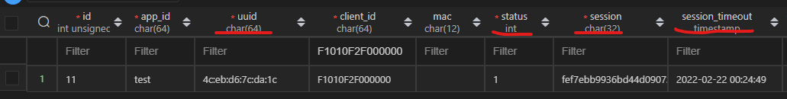

# 设备注册

## 接口定义

+ 接口URL： /api/device/session
+ 接口方法： POST
+ 请求参数

| 请求参数 | 类型 | 可选 | 意义 |
| - | - | - | - |
| appId | string | 必填 |  应用ID |
| deviceId | string | 必填 |  设备注册用的标识ID，可以取mac等 |
| signature | string | 必填 |  签名（参考下文），用来判定是否合法设备 |
| time | string | 必填 |  当前时间戳（UNIX秒级时间戳） |
| hardwareInfo | object | 必填 |  设备标识信息 |
| hardwareInfo.mac | string | 可选 |  设备MAC地址 |
| hardwareInfo.cpu | string | 可选 |  设备CPU ID |
| hardwareInfo.bid | string | 可选 |  设备其他唯一ID |

+ 返回值

| 返回值 | 类型 | 意义 |
| - | - | - |
| rc | string | 错误码 |
| appId | string | 应用ID |
| clientId | string | 设备唯一ID |
| session | string | 设备会话ID |
| expire | int | 会话过期时间（UNIX时间戳），设备需要在此时间前申请新的session |
| timeout | int | 会话过期时间，距离当前的秒钟数 |


+ 错误码

| 错误码 | 意义 |
| - | - |
| 0 | 成功 |


## 接口示例

+ 请求参数示例
``` json
{
    "appId":"test",
    "deviceId":"4c:eb:d6:7c:da:1c",
    "signature":"2291fedf2df0970b749a5b18d15fe31d",
    "time":"11",
    "hardwareInfo":{
        "mac":"4c:eb:d6:7c:da:1c",
        "cpu":"4c:eb:d6:7c:da:1c",
        "bid":"4c:eb:d6:7c:da:1c"
    }
}
```

+ 返回示例
``` json
{
    "rc": "0",
    "data": {
        "appId": "test",
        "clientId": "F1010F2F000000",
        "session": "fef7ebb9936bd44d090729034031d977",
        "expire": 1645460689,
        "timeout": 86400
    }
}
```

## CURL测试
``` bash
curl -v -XPOST -d '{"appId":"test","deviceId":"4c:eb:d6:7c:da:1c","signature":"2291fedf2df0970b749a5b18d15fe31d","time":"11","hardwareInfo":{"mac":"4c:eb:d6:7c:da:1c","cpu":"4c:eb:d6:7c:da:1c","bid":"4c:eb:d6:7c:da:1c"}}' http://api.aproton.tech/api/device/session
```

## 签名计算方法
请求中的signature代表签名信息，是服务端用来判定是否合法设备的重要标志；一般设备在访问服务端的时候有三种模式（参考： [设备模式](../manual/apply-device.md) ），不同的模式下signature计算方式也不一样。

+ 应用模式

    为了减少设备生产成本，在生产时，不写入平台为每个设备独立生成的密钥或者公私钥，只使用设备自身的mac等作为设备的唯一标识，但是同时为了非法设备的伪造，一般在设备生产时写入应用的密钥（这种情况下所有设备的密钥都是一致的，方便批量化生产）。

    这里假设写入的信息： 

    - 应用ID表达为 appId,
    - 应用secret表达为 appSecret
    
    设备自身的唯一标识（一般可以使用mac替代），这里我们定为uuid。 其他信息如果可以获取也可以补充上，比如 cpuId 等 （参考请求中的 `hardwareInfo` 字段）

    那么
    ```
    # 公式中加号 '+' 代表字符串连接
    signature=md5(md5(appSsecret + uuid + hardwareEncodeString) + "aproton.tech")
    ```
    
    其中`hardwareEncodeString` 代表`hardwareInfo`编码之后的字符串。具体方法是将`hardwareInfo`中所有的key,value按照字典序排序，比如 bid,cpu,mac 等；然后每一项组成字符串 `key=value`，不同组的key/value之间通过','连接。示例如下：
    ```
    input_hardwareInfo = {"mac":"4c:eb:d6:7c:da:1c","cpu":"","bid":"abcdef"}
    hardwareEncodeString="bid=abcdef,cpu=,mac=4c:eb:d6:7c:da:1c"
    ```


+ 独立Secret模式

    待补充

+ 独立公私钥模式

    待补充

## 其他
### 数据库影响字段

该接口会影响到图中标红字段

