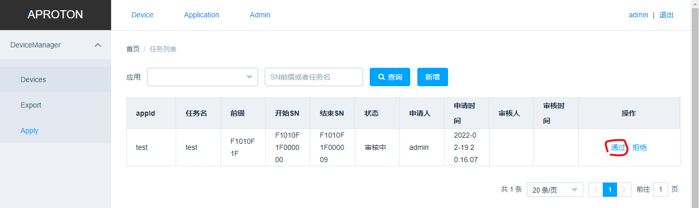
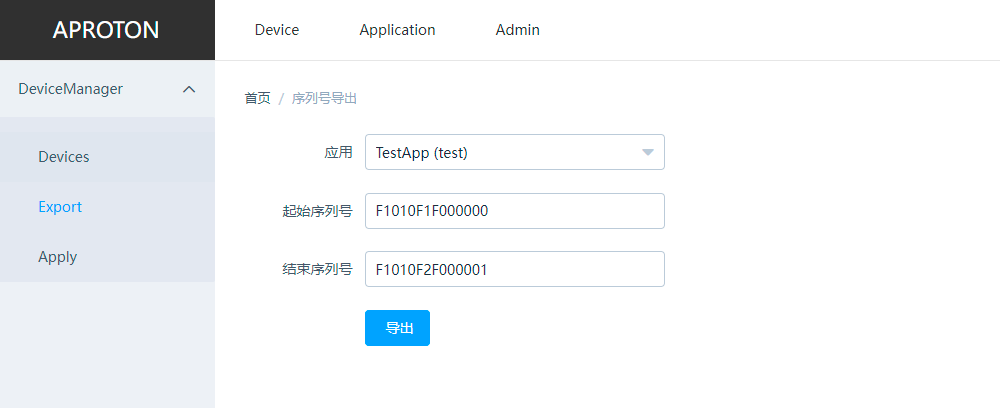

# 申请设备

## 申请列表

菜单路径: Device -> Apply

## 创建申请
菜单路径: Device -> Apply -> 新增

注： 设备ID有两种注册模式，预置设备，在线生成。
+ 预制设备： 生成设备的所有信息，设备生产时需要将平台中的密钥信息烧录到设备中，然后才可以正确访问平台； 平台申请通过后，可以在设备列表页面中直接看到对应的设备信息。
+ 在线生成： 生成设备的关键信息，但是设备生产时只需要将平台应用信息烧录到设备中，然后设备会根据应用信息自动关联到申请的设备ID中（随机挑选）。 平台申请通过后，不能在设备列表中看到设备信息，只有到真实设备启动关联到具体设备ID后，才会显示在列表页中。

## 审核
菜单路径: Device -> Apply

在申请列表页，通过或者拒绝申请。通过后将自动生成对应的设备列表

## 设备导出
菜单路径： Device -> Export

选择对应的应用，以及SN范围，导出设备列表CSV文件。

